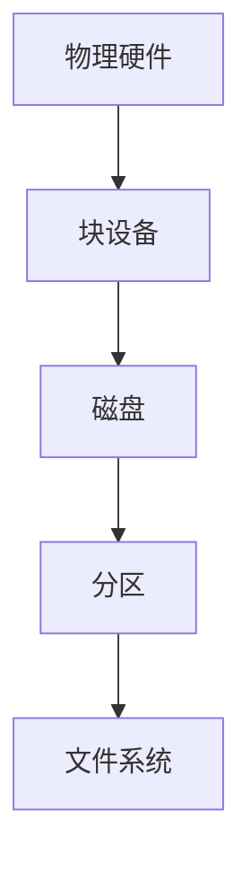

# Linux 文件系统的基本概念与操作

::: info 本文信息
作者：thezzisu<sub>with Claude Sonnet</sub>

状态：待审阅

:::

## 块设备、磁盘与分区的概念

在开始学习 Linux 文件系统之前，我们需要先理解几个基本概念，它们之间的关系如下：



### 块设备

块设备是一种以块（block）为单位进行数据读写的设备。与字符设备（按字符读写）不同，块设备允许随机访问数据，可以跳到任意位置读写数据。最常见的块设备就是硬盘。

一些关键特点：

- 以固定大小的块为单位读写数据（通常是 512 字节或 4KB）
- 支持随机访问，可以直接跳转到任意位置
- 在 Linux 中以特殊文件形式存在，通常位于 `/dev` 目录下

### 磁盘

磁盘是最常见的块设备，在 Linux 系统中有不同的命名规则：

- IDE/SATA 硬盘：`/dev/sda`, `/dev/sdb`, `/dev/sdc`...
- NVMe 固态硬盘：`/dev/nvme0n1`, `/dev/nvme0n2`...
- 虚拟磁盘：`/dev/vda`, `/dev/vdb`...

其中字母表示不同的物理设备，数字表示分区编号。

### 分区

分区是将一个物理磁盘划分为多个逻辑区域的方式。分区的主要目的是：

- 更好地组织和管理数据
- 提高系统性能和安全性
- 支持多个操作系统共存

分区类型：

1. MBR 分区表（传统）

   - 最多支持 4 个主分区
   - 或 3 个主分区 + 1 个扩展分区（扩展分区可包含多个逻辑分区）
   - 单个分区最大支持 2TB

2. GPT 分区表（现代）

   - 支持最多 128 个主分区
   - 支持超过 2TB 的分区大小
   - 更好的容错性

### 文件系统

文件系统是在分区之上建立的数据组织方式，它决定了如何在分区中存储和管理文件。常见的 Linux 文件系统类型包括：

- `ext4`：Linux 最常用的文件系统，功能强大且稳定
- `xfs`：适合大容量存储，性能优秀
- `btrfs`：新一代文件系统，支持快照等高级特性
- `fat32/ntfs`：主要用于与 Windows 系统交互

#### 不同文件系统的区别

- `ext4`：支持大文件和大分区，具有良好的性能和稳定性，适合大多数场景。
- `xfs`：在处理大文件和高并发访问时表现优异，适合大容量存储和高性能需求的场景。
- `btrfs`：支持快照、压缩和子卷等高级特性，适合需要高级数据管理功能的场景。
- `fat32/ntfs`：主要用于与 Windows 系统交互，`fat32` 适合小容量 U 盘，`ntfs` 适合大容量存储设备。

如果你不知道怎么选择，`xfs` 是一个不错的选择。

#### 选择文件系统的最佳实践

- 对于大多数 Linux 系统，推荐使用 `ext4` 文件系统。
- 对于需要处理大文件和高并发访问的场景，推荐使用 `xfs` 文件系统。
- 对于需要高级数据管理功能的场景，推荐使用 `btrfs` 文件系统。
- 对于需要与 Windows 系统交互的存储设备，推荐使用 `fat32` 或 `ntfs` 文件系统。

## Linux 的挂载机制

Linux 系统中的所有文件都在一个统一的目录树中，通过挂载将物理设备整合到这个目录树中：

```mermaid
graph LR
    A[物理设备] --挂载--> B[挂载点]
    B --> C[统一目录树]
    C --> D[/]
    C --> E[/home]
    C --> F[/mnt]
```

### 挂载的概念

挂载（mount）是将一个文件系统关联到目录树的过程。可以把它想象成把一个新的抽屉（文件系统）安装到书柜（目录树）上。

为什么需要挂载：

- 保持文件系统的统一性
- 灵活管理不同的存储设备
- 实现文件系统的动态扩展

### 挂载点与目录树的关系

- 挂载点是目录树中的一个目录
- 挂载后，访问该目录就等于访问被挂载的文件系统
- 常用的挂载点位置：
  - `/mnt`：临时挂载点
  - `/media`：可移动设备自动挂载点
  - `/`：根文件系统挂载点

### 自动挂载与手动挂载

Linux 系统支持两种挂载方式：

1. 自动挂载

   - 系统启动时通过 `/etc/fstab` 自动挂载
   - 对于 Linux 部分桌面发行版，插入可移动设备时通常由 `udisks2` 自动挂载，无需手动干预

2. 手动挂载
   - 使用 `mount` 命令临时挂载
   - 系统重启后需要重新挂载

## Linux 磁盘与文件系统常用命令

### 查看磁盘信息

1. 使用 `fdisk -l` 查看分区信息

```plain
Disk /dev/sda: 500 GB
Device      Boot  Start     End Sectors  Size Id Type
/dev/sda1   *     2048  999423  997376  487M 83 Linux
/dev/sda2      999424 41943039   40.9G  83 Linux
```

2. 使用 `lsblk` 查看块设备信息

```plain
NAME   MAJ:MIN RM  SIZE RO TYPE MOUNTPOINT
sda      8:0    0  500G  0 disk
├─sda1   8:1    0  487M  0 part /boot
└─sda2   8:2    0 40.9G  0 part /
```

3. 使用 `df -h` 查看磁盘使用情况

```plain
文件系统        容量  已用  可用 已用% 挂载点
/dev/sda2        41G   15G   24G   39% /
/dev/sda1       487M   98M  364M   22% /boot
```

### 磁盘分区操作

::: warning 警告
在进行任何分区操作之前，请确保：

1. 已备份重要数据
2. 确认操作的设备名称正确（可使用 `lsblk` 和 `fdisk -l` 仔细核对）
3. 了解分区操作可能带来的风险

:::

4. 使用 `fdisk` 创建新分区

```bash
sudo fdisk /dev/sdb
```

常用的 `fdisk` 交互命令：

- `n`：创建新分区
- `p`：打印分区表
- `d`：删除分区
- `w`：写入更改并退出
- `q`：不保存退出

2. 使用 `parted` 命令（支持 GPT）

```bash
sudo parted /dev/sdb
```

`parted` 的常用命令：

- `mklabel gpt`：创建 GPT 分区表
- `mkpart`：创建新分区
- `print`：显示分区信息
- `rm`：删除分区

### 创建文件系统

1. 在分区上创建 `ext4` 文件系统

```bash
sudo mkfs.ext4 /dev/sdb1
```

2. 创建 `xfs` 文件系统

```bash
sudo mkfs.xfs /dev/sdb1
```

3. 创建 `fat32` 文件系统（用于跨平台兼容）

```bash
sudo mkfs.vfat -F 32 /dev/sdb1
```

### 挂载文件系统

1. 手动挂载

```bash
# 创建挂载点
sudo mkdir /mnt/mydisk

# 挂载分区
sudo mount /dev/sdb1 /mnt/mydisk

# 指定文件系统类型挂载
sudo mount -t ext4 /dev/sdb1 /mnt/mydisk
```

2. 卸载文件系统

```bash
sudo umount /mnt/mydisk
# 或
sudo umount /dev/sdb1
```

### 配置开机自动挂载

编辑 `/etc/fstab` 文件来配置开机自动挂载：

```bash
sudo nano /etc/fstab
```

`fstab` 文件格式：

```plain
# <file system> <mount point> <type> <options> <dump> <pass>
UUID=xxxxx       /mnt/mydisk   ext4    defaults    0       2
```

字段说明：

- `file system`：设备名或 UUID
- `mount point`：挂载点
- `type`：文件系统类型
- `options`：挂载选项
- `dump`：是否备份（0 表示不备份）
- `pass`：开机时 `fsck` 检查的顺序（0 表示不检查）

## 实践练习

### 练习 1：创建并挂载新分区

1. 查看可用磁盘

```bash
sudo fdisk -l
```

2. 在目标磁盘创建新分区

```bash
sudo fdisk /dev/sdb
# 按 `n` 创建新分区
# 按 `w` 保存更改
```

3. 创建文件系统

```bash
sudo mkfs.ext4 /dev/sdb1
```

4. 创建挂载点并挂载

```bash
sudo mkdir /mnt/newdisk
sudo mount /dev/sdb1 /mnt/newdisk
```

5. 配置开机自动挂载

```bash
# 获取分区 UUID
sudo blkid /dev/sdb1

# 编辑 `fstab`
sudo nano /etc/fstab
# 添加如下行
# UUID=<your-uuid> /mnt/newdisk ext4 defaults 0 2
```

### 练习 2：U 盘操作实战

1. 插入 U 盘后查看设备名

```bash
dmesg | tail
# 或
lsblk
```

2. 挂载 U 盘

```bash
sudo mkdir /mnt/usb
sudo mount /dev/sdc1 /mnt/usb
```

3. 安全卸载

```bash
sudo umount /mnt/usb
```

## 常见问题与故障排除

### 1. 挂载失败常见原因

1. 设备忙
   问题：

```plain
mount: /dev/sdb1 is already mounted or /mnt/mydisk busy
```

解决：

```bash
# 查看是否有进程在使用
lsof | grep /mnt/mydisk
# 结束相关进程
sudo kill <PID>
```

2. 文件系统损坏
   问题：

```plain
mount: wrong fs type, bad option, bad superblock
```

解决：

```bash
# 检查并修复文件系统
sudo fsck /dev/sdb1
```

### 2. `fstab` 配置错误修复

如果 `/etc/fstab` 配置错误导致系统无法正常启动：

1. 在启动时进入紧急模式
2. 使用以下命令修复：

```bash
# 以读写方式重新挂载根文件系统
mount -o remount,rw /

# 编辑 `fstab`
nano /etc/fstab

# 注释掉有问题的行
# UUID=xxx /mnt/mydisk ext4 defaults 0 2
```

### 3. 磁盘空间告警

1. 查找大文件

```bash
# 查找大于 1GB 的文件
sudo find / -type f -size +1G

# 按大小排序显示目录占用
sudo du -h / | sort -rh | head -10

# 查看各目录占用情况
sudo ncdu /
```

2. 清理常见的空间占用

```bash
# 清理软件包缓存
sudo apt clean

# 删除旧内核（保留当前使用的内核）
sudo apt autoremove

# 清理日志文件
sudo journalctl --vacuum-time=3d

# 清理临时文件
sudo rm -rf /tmp/*
sudo rm -rf ~/.cache/*
```

3. 扩容方案示例

```bash
# LVM 在线扩容
sudo vgdisplay  # 查看卷组
sudo lvextend -L +10G /dev/mapper/vg0-root  # 扩容 10GB
sudo resize2fs /dev/mapper/vg0-root  # 更新文件系统

# 查看 RAID 状态（如果使用 RAID）
cat /proc/mdstat
```

4. 实际案例分析

- 案例 1：Docker 镜像占用过大

  ```bash
  # 清理未使用的 Docker 资源
  docker system prune -a
  ```

- 案例 2：日志文件占满磁盘

  ```bash
  # 找到大型日志文件
  sudo find /var/log -type f -size +100M

  # 安全清理日志
  sudo truncate -s 0 /var/log/large_log.log
  ```

- 案例 3：备份文件堆积
  ```bash
  # 查找并删除超过 30 天的备份
  find /backup -name "*.bak" -mtime +30 -delete
  ```

## 附注

### ext4 的基本操作命令

1. 创建 ext4 文件系统

```bash
sudo mkfs.ext4 /dev/sdb1
```

2. 检查和修复 ext4 文件系统

```bash
sudo fsck.ext4 /dev/sdb1
```

3. 调整 ext4 文件系统大小

```bash
sudo resize2fs /dev/sdb1
```

### xfs 的基本操作命令

1. 创建 xfs 文件系统

```bash
sudo mkfs.xfs /dev/sdb1
```

2. 检查和修复 xfs 文件系统

```bash
sudo xfs_repair /dev/sdb1
```

3. 增加 xfs 文件系统大小

```bash
sudo xfs_growfs /mnt/mydisk
```

注意：`xfs` 文件系统不支持缩小操作。 `xfsprogs 5.12` 增加了对缩小操作的实验性支持，但仍需谨慎使用。

### btrfs 简介

`btrfs` 是一种现代的 Linux 文件系统，支持快照、压缩和子卷等高级特性，适合需要高级数据管理功能的场景。

#### btrfs 子卷

btrfs 子卷（subvolume）是 btrfs 文件系统中的一个逻辑分区，可以独立管理和操作。子卷类似于目录，但具有独立的文件系统属性，可以单独进行快照和备份。

#### btrfs 基本概念与操作命令

1. 创建 btrfs 文件系统

```bash
sudo mkfs.btrfs /dev/sdb1
```

2. 创建子卷

```bash
sudo btrfs subvolume create /mnt/mydisk/subvol
```

3. 创建快照

```bash
sudo btrfs subvolume snapshot /mnt/mydisk/subvol /mnt/mydisk/snapshot
```

4. 检查和修复 btrfs 文件系统

```bash
sudo btrfs check /dev/sdb1
```

5. 调整 btrfs 文件系统大小

```bash
sudo btrfs filesystem resize +10G /mnt/mydisk
```

### LVM 简介

LVM（Logical Volume Manager，逻辑卷管理器）是一种灵活的磁盘管理工具，可以动态调整磁盘分区大小，方便磁盘空间的管理和扩展。

在部分 Linux 发行版中，安装系统时默认就会配置 LVM。如果你在 `fstab` 中看到 `/dev/mapper` 开头的设备，那么你的系统可能已经使用了 LVM。

#### LVM 的基本概念

1. **物理卷（PV）**：物理硬盘或分区，通过 `pvcreate` 命令创建。
2. **卷组（VG）**：由一个或多个物理卷组成，通过 `vgcreate` 命令创建。
3. **逻辑卷（LV）**：从卷组中分配的逻辑存储单元，通过 `lvcreate` 命令创建。

#### LVM 的基本操作命令

1. 创建物理卷

```bash
sudo pvcreate /dev/sdb1
```

2. 创建卷组

```bash
sudo vgcreate myvg /dev/sdb1
```

3. 创建逻辑卷

```bash
sudo lvcreate -L 10G -n mylv myvg
```

4. 创建文件系统

```bash
sudo mkfs.ext4 /dev/myvg/mylv
```

5. 挂载逻辑卷

```bash
sudo mkdir /mnt/mylv
sudo mount /dev/myvg/mylv /mnt/mylv
```

6. 扩展逻辑卷

```bash
sudo lvextend -L +5G /dev/myvg/mylv
sudo resize2fs /dev/myvg/mylv
```

LVM 使得磁盘管理更加灵活，特别适合需要频繁调整磁盘空间的场景。
