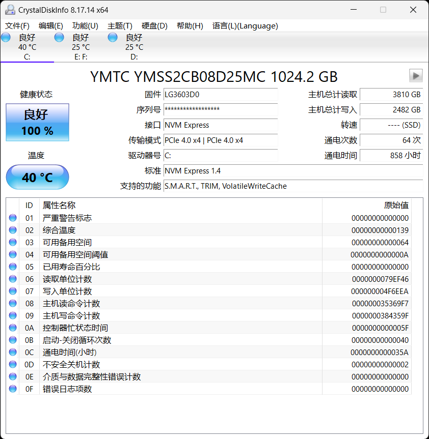
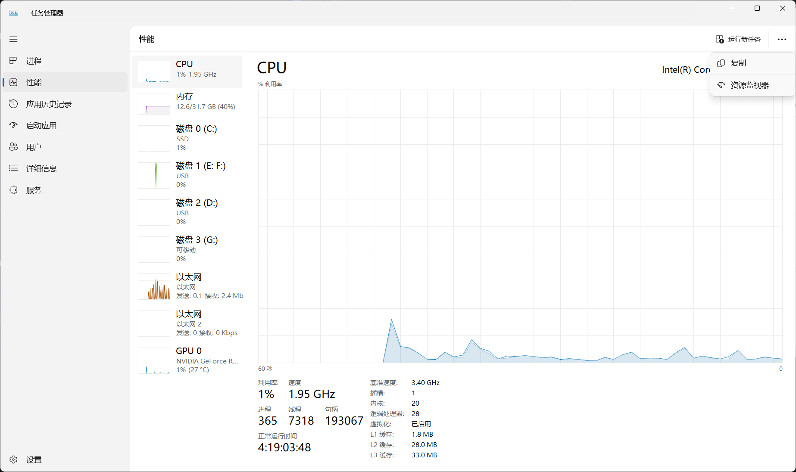

# 用好你的电脑 III：故障自查与知识串讲 {#heading}

::: info 本文信息
作者：000lbh LightYourJourney

状态：未审阅的草稿版本
:::

## 硬件资源监控 {#hw-monitor}

有时候我们需要检查硬件的信息，包括处理器占用情况，内存占用情况，磁盘占用情况等等，以进行故障排除。

### 磁盘信息 {#disk-info}

如需查看磁盘占用情况，Windows 和 Linux 下的文件管理器都能直观地提供以上信息，故此不再详述。

如需查看磁盘健康情况，可以使用`smartctl`命令(Linux)或者 CrystalDiskInfo 软件(Windows)查看。

图 1. 笔者使用 CrystalDiskInfo 查看磁盘信息

### 处理器与内存信息 {#cpu-mem-info}

Windows 下任务管理器即可，Linux 下推荐`btop`程序。

图 2. 笔者使用任务管理器查看处理器占用情况，右侧菜单可以打开资源监视器，有更详细的信息。

### 电池信息 {#battery-info}

Windows 下可以使用自带的`powercfg`命令生成 html 格式的电池信息报告，Linux 下可以使用`upower`命令查看

### 视频信息 {#video-info}

(TODO)

### 音频信息 {#audio-info}

(TODO)

## 常见故障自查 {#troubleshooting}

### 蓝屏 {#bsod}

蓝屏(BSOD, Blue Screen of Death)，通常意味着 Windows 内核发生了不可恢复的故障。常见的蓝屏原因包括系统服务异常（多是驱动导致），关键进程退出（可能是病毒引起），机器检查（硬件故障）等。如果最近新安装了硬件，可以考虑移除它们再试试，如果怀疑是驱动问题或者是病毒问题，可以考虑进入安全模式：

- 如果你还能进入系统：按下`Win+R`输入`msconfig`并回车，点击“引导”选项卡，勾选“安全启动”，点击应用，重启即可。

- 如果你不能进入系统：启动失败若干次后应该会出现恢复菜单，点击“疑难解答”-“高级选项”-“启动设置”，会提示重启进入安全模式。

安全模式下只有最基本的驱动和启动项会被加载，可以考虑卸载最近安装的驱动或者查杀病毒，如需查杀病毒，建议选择带网络的安全模式。

以前的系统也可通过启动时按 F8 进入安全模式菜单，但是目前这样做不太可行。

完成所有操作后，如果使用 msconfig 设置了安全模式，应当先取消勾选然后应用，然后重启回到正常模式看问题是否解决。

如果你想向驱动作者报告问题，可以使用 WinDbg 调试内核转储文件，在 WinDbg 中打开转储文件，使用`!analyze -v`获取完整分析报告。WinDbg 可以在应用商店中免费获取。

### 内核恐慌 {#panic}

Linux 内核的严重错误被叫做 panic。其实由于 Linux 用户态和内核态耦合更低，且 Linux 本身容错能力更好，Linux panic 遇见的频率相对更低，常见的原因也不外乎驱动故障，1 号进程退出等。一般来说，部分硬件厂商为 Linux 提供的驱动问题较多，除了卸载驱动以外，还需要和驱动开发者和 Linux 内核维护者进行沟通，以取得更好的解决方案。

### 应用软件崩溃 {#application-crash}

这种情况比较复杂，有可能是软件本身的 bug，也有可能是用户的环境或者使用软件的方式的问题。部分软件带有崩溃反馈模块，你可以用这个模块向开发者反馈信息。在反馈之前，请先确保你的软件是最新的，因为你发现的故障可能在新版本中已经被修复，同时需确保你正确使用软件。然后向开发者反馈故障时，尽可能给出软件版本、操作系统版本、库版本（如果有需要）、硬件型号等信息，同时需给出较为详细的复现故障的步骤，必要时附上日志和截图（不要在正文中放大段日志，最好以附件或者在线剪贴板链接，如[gist](https://gist.github.com/)的形式给出）。如果你使用 Linux 并且恰好开启了核心转储，你也可以调试转储文件（例如使用`coredumpctl -r debug`，然后输入`bt`），给出栈回溯信息等。

如果你想自行调试，首先你可以寻找软件是否提供了调试符号包，在没有调试符号包和源码的情况下调试将会是非常困难的，而且两者都不提供的软件通常在许可上不允许你做调试（因为会涉及反汇编），除非万不得已，不建议自行调试这种软件。如果没有调试符号包但是有源码，你可以尝试在干净的环境中重新构建带调试符号的软件包，对于用 gcc 编译的软件，可以考虑加上编译参数`-g`。同时不建议使用较高的优化等级，这会给调试带来困难，除非你确信是高优化等级导致的问题。

### 系统启动慢 {#system-slow}

Windows 下打开任务管理器检查有无不必要启动项，加以禁止即可；Linux 下可以使用`journalctl`检查日志，留意启动慢的服务，有针对性地加以解决，或者直接禁用服务

### 应用程序慢 {#app-slow}

建议首先检查内存和处理器占用情况，结束其他无关程序；对于有网络 IO 的程序，检查网络连接；对于有磁盘 IO 的程序，检查磁盘健康状态。

### 网络连接故障 {#offline}

建议检查网线是否插好，网关是否登陆，是否欠费，DNS 设置是否正确，上一次关机时代理是否正确关闭等等。对于 Linux 系统，可以检查`rfkill`是否允许相应网卡工作，`ip`是否启动相应适配器。

## 小知识串讲 {#knowledge-series}

### 快捷键 {#shortcut}

#### 系统快捷键 {#system-shortcut}

不同系统提供了不同的快捷键，这里简单介绍 Windows 和 Linux 在系统层面提供的快捷键。Windows 徽标键（简称 Win 键）在 Linux 下也称 Meta 键，在 Mac 下则是 Command 键。F1-F12 系列按键有可能需要同时按下 Fn 键使用。

- Windows

  `Ctrl+Alt+Del`: 打开一个可以唤起任务管理器的屏幕。这个组合键比较特殊，它只能被内核捕获而不会传给用户态程序处理。

  `Ctrl+Shift+Esc`: 直接打开任务管理器。

  `Alt+F4`: 关闭处于焦点的窗口。如果没有窗口处于焦点，打开关闭计算机的对话框。

  `Alt+Tab`: 切换窗口。

  `Win+Tab`: 切换桌面。

  `Win+R`: 打开运行窗口。

  `PrintScreen(PrtSc)`: 截图

- Linux

  Linux 下很多快捷键由桌面环境提供，在此无法一一讲述，有兴趣的可以自行了解。一般这些快捷键可以根据个人使用习惯重新配置。

  `Ctrl+Alt+{F1-F12}`: 切换 tty。一般图形桌面位于 tty1 或者 tty2。这一系列快捷键由 Wayland 或者 Xorg 提供

  `Alt+SysRq`: 这是一系列快捷键，其中 SysRq 键就是 PrintScreen 键（有的键盘应该会在 PrintScreen 键下面一行写上 SysRq），按下这个组合键后，再按下特定按键，内核会有不同的功能，如按下`C`会让内核强制崩溃；按下`E`会向所有进程发送 SIGTERM 使得它们可以做一些清理后退出；按下`I`会向所有进程发送 SIGKILL 使得它们强行退出；按下`S`会同步磁盘写入；按下`U`会使得所有文件系统被重新挂载为只读；按下`B`会让计算机立刻重启。注意：SysRq 功能可以使用 sysctl 进行配置，默认可能并未开启全部功能。利用这些快捷键可以救回卡死的系统，或者可以在保证文件系统完整的情况下强行重启电脑。

- MacOS

  如果你有 Windows 的使用经历，那么大部分情况下，你可以将 macOS 下的 `Option` 键视为 Windows 下的 `Alt` 键，将 Command 键视为 Windows 下的 `Ctrl` 键。

  下面是一些常用的 macOS 快捷键：

  - `Command+C`: 复制（或者用 Apple 一向的逻辑：拷贝）
  - `Command+V`: 粘贴
  - `Command+X`: 剪切
  - `Command+A`: 全选
  - `Command+Z`: 撤销
  - `Command+Shift+Z / Command+Y`: 重做
  - `Command+F`: 查找
  - `Command+Shift+3`: 全屏幕截图
  - `Command+Shift+4`: 选区截图
  - `Command+Shift+5`: 完整的截图工具。窗口截图和录屏都可以在这里找到
  - `Command+Tab`: 切换应用
  - `Command+Q`: 退出当前应用
  - `Command+W`: 关闭当前窗口
  - `Command+M`: 最小化当前窗口
  - `Command+Space`: 打开聚焦搜索
  - `Option-Command-Esc`: 打开 `强制退出应用程序` 窗口，类似于任务管理器
  - `Control+左右方向键`: 切换虚拟桌面

  ::: tip
  事实上，上述快捷键不一定是绝对的，例如:

  - 在多标签页的程序（VS Code、浏览器等）中，`Command+W` 用于关闭当前标签页，当没有标签页可以关闭时，关闭窗口。
  - 一般情况下，撤销对应的快捷键是 `Command+Shift+Z`，但是在某些第三方程序，例如 Microsoft Word 中，`Command+Z` 也可以用于撤销。
  - 访达下，`Command+C` 表示把文件复制复制（Copy，拷贝）到剪贴板，而 `Command+D` 表示在当前位置创建副本（Duplicate，复制）。至于 `Command+X`，在选择文件的情况下你不能使用这个快捷键，换句话说：你没法剪切一个文件。
  - 访达下还有一个特殊的快捷键 `Command+Shift+G`，用于快速定位到你指定的文件夹 ~~（对自己敲路径的手速有自信的话，快来试试吧）~~。
  - 多提一嘴：在 Mac 的原装键盘上你可能找不到 `Del` 键，事实上，那个像是退格键的按键被 Apple 称之为 `Delete`。如果你想要删除后边的一个字符用 `Fn+Delete`，删除文件时用 `Command+Backspace`，删除一个对象？随缘吧，可能是 `Delete` 键本身，也可能根本没有快捷键。
  - 你可以在 [Apple 支持](https://support.apple.com/zh-cn/102650) 找到更完整的快捷键参考列表，也可以在顶端菜单栏找到当前应用的快捷键。

  :::

#### Shell 快捷键 {#shell-shortcut}

我们把这些快捷键单独放一栏。因为它们和操作系统关系较小。这些快捷键如无特殊说明主要针对 Linux Shell。

`Ctrl+C`: 发送 SIGINT 到前台进程组，默认行为是程序退出。在 Shell 中复制文本避免按下此键！

`Ctrl+D`: 关闭标准输入，或者说发送 EOF（文件末尾）。在 Windows Shell 中，一般为`Ctrl+Z, Enter`。

`Ctrl+Z`: 发送 SIGTSTP 到前台进程组，默认行为是程序退出，可用`fg`使程序恢复运行，或使用`bg`使程序在后台恢复运行，或者直接向程序发送 SIGCONT 恢复运行。

`Ctrl+\`: 发送 SIGQUIT 到前台进程组，和 SIGINT 不同的是，该信号默认不仅让程序退出，还会产生核心转储文件(coredump)。

`Ctrl+Shift+C`: 复制内容。

`Ctrl+Shift+V`: 粘贴内容。

`Ctrl+A`: 编辑命令时回到行首。

`Ctrl+L`: 清除屏幕，并重新打印当前行。

还有其他很多快捷键，有兴趣的同学可以网上搜索或者看 bash 的 man 手册。

::: tip
上面这些 `Ctrl` 键在 macOS 下对应 `Control` 键，这与 macOS 全局对应 `Command` 键有所区别。

不过这也带来了一些好处，例如：代表复制的 `Command+C` 在终端下不会与 `Control+C` 冲突，无需担心复制的时候一不小心把程序给终止了。
:::
