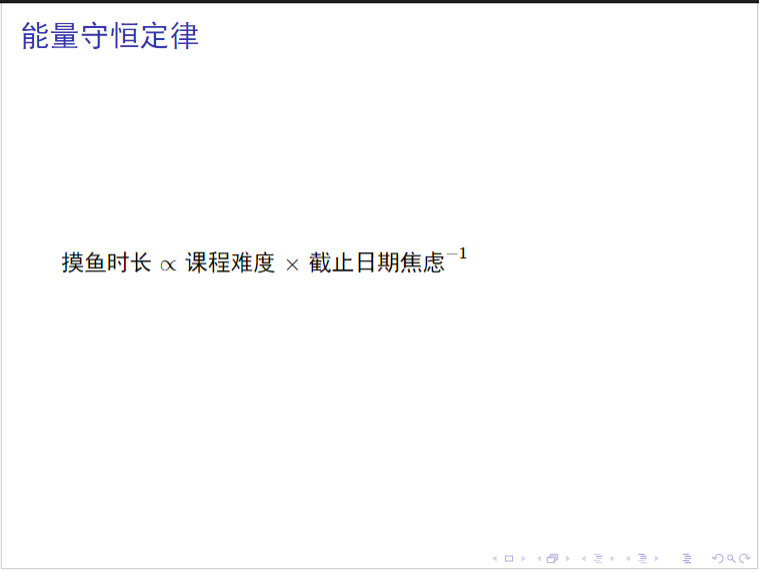
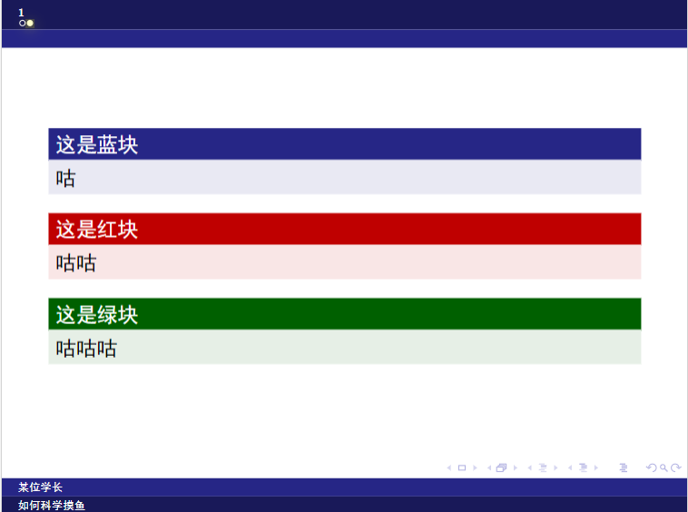
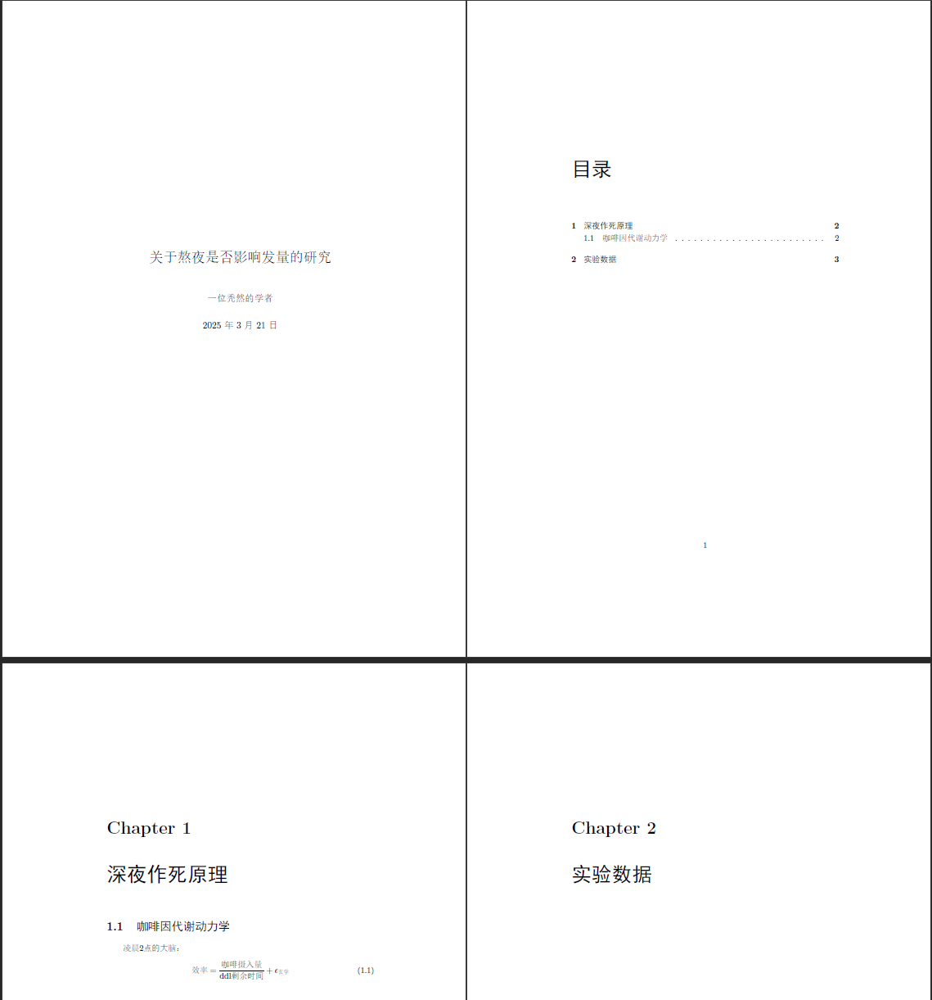
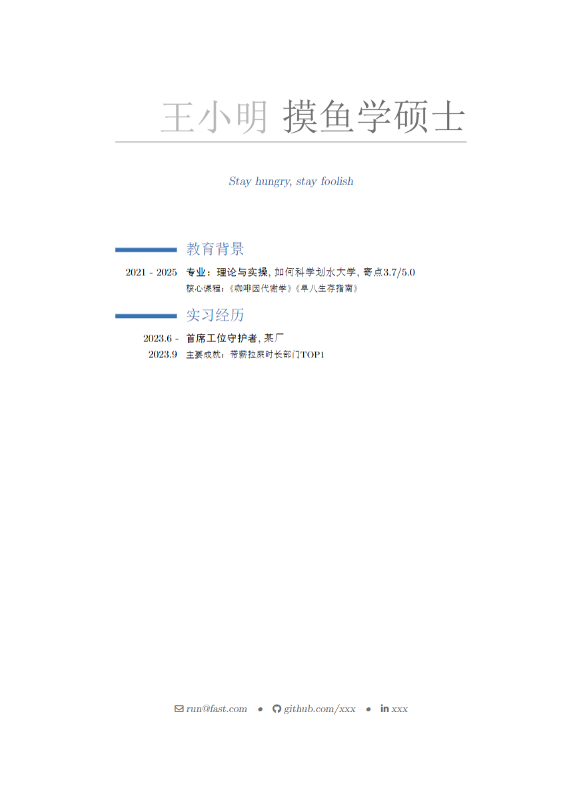

# 文本编辑: Markdown，LaTeX 和 Typst

::: info 本文信息
作者：[The Only Ethene](https://github.com/ZangXuanyi)

状态：尚未审阅
:::

## 引言

文本编辑工具是我们表达思想、传递知识的重要手段。无论是在科研、写作还是展示中，排版都是重要且必要的内容；我们需要选择合适的排版工具，以大大提高作品质量。

有一部分同学可能会认为，我们已经有微软提供的排版利器 Microsoft Word 了，为什么还需要这些看起来非常复杂的内容呢？这是因为，Word 虽然操作简单而舒适了，但是它既不能够像 LaTeX 一样很好地兼容公式、插图、算法等内容，也不能像 Markdown 一样足够轻量级、且完美兼容网络通行的 HTML 格式。而在科研中，LaTeX 更是大多数刊物指定的唯一排版工具，因此不学习相关的内容甚至在科研界寸步难行。

让我们先从最简单的 Markdown 开始吧：

## Markdown

### 什么是 Markdown？

Markdown 是一种轻量级的标记语言，可用于在纯文本文档中添加格式化元素。和其他排版工具相比，它仅仅使用十几个记号进行排版。这使得它易于学习，使得使用者能够更专注于内容的同时，快速地进行美观大方的排版。如你所见，我们所有 Getting Started 文章都是由 Markdown 书写的。

### 怎样使用 Markdown？

Markdown 甚至没有自己的专用编辑器，由此可见其轻量级，令人感叹。一般的，VS Code 已经集成了 MD 的编译，因此你完全可以于 VS Code 中创建一个名为 `*.md` 的文件，然后进行相关的操作。如果需要预览，则可以使用 VS Code 自带的侧边预览功能！

Markdown 的内容输入和纯文本文件几乎一模一样，接下来我们将逐个介绍 Markdown 排版所用到的控制符号。值得注意的是，常用的标点符号（逗号、句号、问号等）均不是控制符号。

不过，在此之前，请把你的输入法标点符号切换为半角，防止出现类似于￥￥的臭名昭著的错误。

#### 分段、换行、分割线

在 Markdown 中，必须通过空行来进行分段。也就是说，如果你想要对文件进行分段，需要在两段之间加入一个空行。特别注意，Markdown 不接受缩进或者首行缩进，所以不要使用 `Tab` 键或者空格进行缩进！（否则会编译为代码块）

而如果希望仅仅换行而不分段，则仅仅在行尾加入两个空格，然后另起一行，在新的行中书写; 或者使用兼容性更加好的 HTML 标记，也就是 `<br>` 符号，该符号无需另起一行也可以进行换行操作。<br>
同时，你可能会在某些网站看到行尾 \\ 或者直接换行来进行换行操作，这是因为 Markdown 语法具有明显的**方言性**特征，不同的 Md 编译器对不同符号的处理不尽相同。为了兼容性起见，不建议使用这些符号。

对于分割线 (你经常会在知乎看见这种分割线)，请在单独一行上使用三个或多个星号 (`***`)、破折号 (`---`) 或下划线 (`___`) ，并且不能包含其他内容。为了兼容性考虑，请在该分割线前后加上空行。

#### 转义符号 `\`

符号 `\` 是转义符。该符号接下来的下一个符号**不会**被编译为 Markdown 的控制符号(代码块外，代码块内的转义参见代码符号)。这使得你能够在不影响排版的前提下，随意打出几乎所有的符号！

#### 标题符号 `#`

符号 `#` 是标题符号。在一行的开头打 `#` 号，再接一个空格，后面的内容就会被编译成标题。这个空格不是必须的，但是为了兼容性考虑，建议加上。

打几个 `#` 号，最终编译出来的就是几级标题。

#### 强调符号 `*` 和删除线

这两个符号用于特别强调的词句，可以实现**粗体**，_斜体_，**_粗斜体_** 和 ~~删除线~~。<br>
上述四个格式分别可以使用下列方法表示：`**粗体**`、`*斜体*`、`***粗斜体***`、`~~删除线~~`.

你可能会在有些地方见到使用下划线 `_` 来进行类似操作的，但是同样为了兼容性考虑我不建议这样做。

值得注意的是，Markdown 不原生支持 <u>下划线</u> ；但因其支持 HTML 嵌入，可以通过 `<u>下划线</u>` 标签实现类似效果。不过需注意，在 HTML5 中该标签具有特定语义，建议装饰性下划线应通过 CSS 实现。

#### 代码符号

这个符号用于进行代码高亮与代码块高亮.

小块代码高亮使用方法非常简单: 使用 `` ` `` 把你需要的代码内容包装起来即可，例如 `` `Hello, world!` ``

代码块则稍稍复杂一些，你可以使用 `把你需要的代码块内容包装起来。在第一个` 之后，你可以手动指定代码使用的语言。直接进行缩进也可以定义代码块。

代码块**不属于** Markdown 正文，因此内部的内容**不会**被编译。你可以用完全相同的方式输入任何代码，而不必增加多余的空行。下面就是一个实例：

```cpp
#include <iostream>
#include <cstdio>

int main()
{
    std::cout << "Hello, world!" << std::endl;
    return 0;
}
```

如果需要在代码块中打出 `` ` `` 且防止此反引号被编译，你可以这样编译: `` ` `` 。只要保证用于包装的反引号数量比防止编译的反引号数量多就可以了。注意，一定要使用空格分开反引号以避免歧义！

#### 列表符号 `1.` 和 `-`

要创建有序列表和无序列表，可以分别使用上述的两个符号。上述几个符号和标题符号的使用方法类似，这两格符号位于行首，前面不能有内容，后面应该有空格。

有序列表无序列表之间是可以嵌套的；如果要制作多级列表，请使用 `Tab` 缩进多级列表的内容即可。

值得注意的是，有序列表中的 `1.` 也可以替换为其他数字，反正满足数字加个点就行，Markdown 会自动帮你排序。

例如：

```plain
1. 甲乙丙丁
1. 戊己庚辛
    1. 子丑寅卯
    1. 辰巳午未
        - 申酉
        - 戌亥
1. 壬癸
```

会编译为：

1. 甲乙丙丁
1. 戊己庚辛
   1. 子丑寅卯
   1. 辰巳午未
      - 申酉
      - 戌亥
1. 壬癸

#### 引用符号 `>`

这个符号用于插入引用块，处于引用块内部的文字与普通文字一样。和标题符号一样，`>` 后面最好是有一个空格，且前面什么都不要有：

引用块也是可以堆叠的，只需要多增加几个引用符号即可：

> 偏差认知了
>
> > 偏差认知
> >
> > > 偏差认
> > >
> > > > 偏差
> > > >
> > > > > 偏

~~故障机器人是杀戮尖塔最强角色！~~

如果需要在不切断引用块的情况下分段，请在预定的空行开头也加上上述引用符号。

#### 表格

你可以使用下列手段创建一个原生表格：使用三个或多个连字符（`---`）创建每列的标题，并使用管道（`|`）分隔每列。可以选择在表的任一端添加管道。

你不必过度在意排版问题，编译器会自动给你编译出优美的格式。

如果要使用左对齐/居中/右对齐，请在连字符那里添加冒号：左对齐使用 `:---`，居中使用 `:---:`，右对齐使用 `---:` 。

下面是一个实例：

```plain
| Syntax | Description |
| --- | ----------- |
| Header | Title |
| Paragraph | Text |
```

得到的表格是这样的：

| Syntax    | Description |
| --------- | ----------- |
| Header    | Title       |
| Paragraph | Text        |

表格中可以添加链接，代码（仅反引号（`）中的单词或短语，而不是代码块）和强调；但是不能添加标题，块引用，列表，图像或 HTML 标签。

#### 外部路径: 图片与链接

要添加图像，请使用感叹号 `!`，然后在方括号增加替代文本，图片链接放在圆括号里，括号里的链接后可以增加一个可选的图片标题文本。

例如，这是本文主要作者的 GitHub 头像，则使用 ``


如果你需要在文档中插入链接，则把链接文本放在中括号内，链接地址放在后面的括号中。

例如，一个著名代码共享平台叫做 [GitHub](https://github.com)，其中 GitHub 这个超链接就是使用代码`[GitHub](https://github.com)`完成的。

对于图片型超链接，则把前面的中括号内的链接文本改为上述的图片路径即可。

#### 公式符号: `$`

使用 `$ $` 框住对应的 LaTeX 公式，即可将对应的公式按照 LaTeX 格式编译出来，使用方法和 LaTeX 完全一致。如果需要进一步教学，请移步 LaTeX 相关篇章。

::: tip 特别注意

公式的前后应该有空格，否则不会编译。这是 Markdown 的自动转义特性导致的。

```plaintext
这样写:
这是一个 LaTeX 公式

而不要这样写:
这是一个LaTeX公式
```

:::

例如：调和级数 $\sum_{i=1}^n \frac{1}{i}$ 可以使用 `$\sum_{i=1}^n \frac{1}{i}$` 进行编译。

::: tip 特别提醒

1。一定要用半角标点符号，否则你会见到臭名昭著的 ￥￥ 类错误。

2。大多数的 Markdown 编译器都会正确渲染 LaTeX 公式，但是不排除少数编译器不支持渲染 LaTeX，一般而言，不支持渲染的编译器将会原样显示公式内容。开始写作前试试编辑器能否正常渲染公式总是好的选择。

:::

## LaTeX

### 什么是 LaTeX ？

LaTeX 是一种极为专业的**排版**工具，而**不是**文本编辑器。它的源文档与 Markdown 的简洁干净不同，而是充斥了各种各样的反斜杠，大括号和宏。这表明了如果直接使用 LaTeX 进行文本编辑的话会令人极度头大乃至效率降低；因此我个人建议同学们在使用上述工具时，最好是心中打好腹稿然后再进行工作。

纵然如此，LaTeX 依然是目前最强大的排版工具，没有之一。其强大的功能甚至能够支持其于一个 PDF 文件中写一个 Linux 系统；而且这个系统甚至可以直接运行！虽然如此，我们暂时不需要研究 Linux in PDF 的工作原理，还是从最简单的 LaTeX 安装与使用开始吧。

### 怎样安装 LaTeX ?

虽然 LaTeX 功能强大，但是其安装过程非常缓慢且困难。对于不愿意在自己电脑上本地安装这东西的读者，笔者建议使用一些线上编译器，例如著名的 Overleaf 等。[PKU LaTeX](https://latex.pku.edu.cn/) 也是一个线上编译器，由 LCPU 开发并维护，欢迎大家使用！~~（才...才不是给自己打广告呢）~~

这里讲的下载和本地安装均针对版本较新的 TexLive 而言。这里非常感谢[yjdyamv](https://github.com/yjdyamv)和[OsbertWang](https://github.com/OsbertWang)的帮助，笔者撰写此篇时多有参考与引用[LaTeX 安装简短说明](https://github.com/OsbertWang/install-latex-guide-zh-cn)这一仓库的内容。

#### 第一步：下载并安装镜像

##### Windows

在安装新的 TexLive 之前，笔者建议彻底删除任何旧版的 CTeX 套装，同时检查环境变量中有没有`C:\Windows\system32`。如无，请将上述路径添加回环境变量中去。

然后，检查自己的用户名是不是无空格的英文。如果不是，建议修改，这是一个一劳永逸的办法。另一个办法是执行以下命令（注意：PowerShell 用户请自行替换命令为正确的命令）

```bash
mkdir C:\temp
set TEMP=C:\temp
set TMP=C:\temp
```

如无意外，用户可以从最近的 CTAN 源下载 TexLive 的相关镜像（这个镜像大小高达 6GB）。当然，官网下载过程是非常缓慢的，如果实在是无法忍受其速度，可以考虑改用其他镜像站。

由于未知原因，如果计算机上提前安装了`jdk`、`mingw`或`Cygwin`，建议暂时先把以上软件从环境变量中剔除，等整个安装好了以后再加回去。2345 好压可能也会导致类似的错误，本人建议彻底卸载之，并从此以后不要碰相关的东西~~下崽器（不是）~~；笔者推荐使用 7z 这个压缩软件。

下载下来的镜像往往是一个`*.iso`虚拟光驱镜像，将这个镜像装载到光驱，并执行其中的`install-tl-windows.bat`批处理文件后，在弹出的视窗中选择清华源（或者你离哪里近就用哪个源，在校内的可以使用在校内速度更快~~存疑~~的北大源`http://mirrors.pku.edu.cn/ctan/systems/texlive/`），并安装。如果你希望更改默认的安装路径，笔者建议提前在对应位置创建好一个目录，该目录不应该包含**非 ASCII**字符；或者更通俗的说，该目录应该是**不含空格的英文目录**。同时，笔者并不建议安装 TexLive 前端（仅仅是因为不好用），稍后会讲述如何配置 VS Code 作为 LaTeX 的编辑器。

~~当然如果你足够 geek 你确实是可以使用记事本来写的，但是笔者并不推荐你这么做~~

整个安装过程随着计算机的不同，所需时间也有所不同，估计可能需要数十分钟到数小时不等。

##### Linux：以 ubuntu 为例

由于众所周知的原因，建议在安装前将 Ubuntu 源改至国内源。具体操作不在这里叙述，Linux 用户可以自行查找相关资料。

在下载完光盘镜像以后，依次执行以下内容（不要输入注释）：

```bash

sudo apt install fontconfig gedit # 这一步是为了避免之后的字体问题和文本编辑问题
sudo mkdir /mnt/texlive # 创建临时挂载目录
sudo mount ./texlive2025.iso /mnt/texlive # 把安装镜像挂载到上述目录

sudo /mnt/texlive/install-tl # 运行上述安装程序
```

然后终端将会弹出大量内容，读者可以按需自行安装。在安装完毕后，依次执行以下内容：

```bash
sudo umount /mnt/texlive # 把安装镜像卸载
sudo rm -r /mnt/texlive # 删除临时挂载目录
```

在安装完毕后，安装程序会提醒用户把一些目录加到环境变量中去。我们可以使用 gedit 进行操作。

```bash
gedit ~/.profile
# 然后把对应的目录添加到环境变量中去。
```

保存退出后，注销用户并重新登陆，并输入`tex -v`命令，如果该命令能被识别并执行，则说明安装成功。

下面配置字体。只有这样，TexLive 的字体才能被正确调用。以下是一个示例，如果用户改变了安装路径，应该把`/usr/local/texlive/2025`修改成你的**实际**安装路径。

```bash
sudo cp /usr/local/texlive/2025/texmf-var/fonts/conf/texlive-fontconfig.conf /etc/fonts/conf.d/09-texlive.conf
sudo fc-cache -fsv
```

##### 其他系统

建议阅读[LaTeX 安装简短说明](https://github.com/OsbertWang/install-latex-guide-zh-cn)。

#### 在 VS Code 的配置

同学们在安装完毕后，理论上确实可以使用 xelatex 或者类似的命令来对指定的文件进行编译，但是这并不舒服。本人依然建议使用一个特定的工具来做这一工作。

这样的类似工具有很多，综合笔者的使用体验，免费的 VS Code 应该是书写 LaTeX 文档的最舒适工具。这一段参考了仓库[vscode-latex](https://github.com/EthanDeng/vscode-latex)。

本文以 Windows 为例（因为笔者刚刚给自己的笔记本覆盖安装系统了）。其它系统可以参考以下文本，并广泛阅读网络上的其他配置说明来进行配置。

安装以下插件：`Latex Workshop`（作者是 James Yu）。然后，如果没有什么特殊需求的话就可以直接写文档然后编译了。如果有特殊需求，请上网查找相关内容然后进行操作。

### 怎样使用 LaTeX ?

LaTeX 功能最强大的一点在于它支持巨量的包与文件类型，使得它能够适用于大量工作: 短文用 `article`，长文用 `report`，书本用 `book`，信件用 `letter`，简历用 `moderncv`，幻灯片用 `beamer`……遗憾的是，上述文档类型除了大部分相同的通用语法以外，还都有着自己独立的宏和语句功能。如果需要全部精通上述文档类型，难度不亚于掌握 `C++23` 的所有头文件，连笔者都不能说自己全部掌握了它们。因此我将仅仅讲述基本语法，实用包和几种文档类型。

### 基本语法

一个最基本的 LaTeX 文档应该如下代码块所示：

```latex
\documentclass{article}

\begin{document}
Hello, Latex!
\end{document}
```

上述第一行代码表明了文章的类型是 `article`，其意思是短文，通常用于不太长的论文书写，是 LaTeX 的最基本文档类型。

中间的 `begin...end` 结构则是 LaTeX 中最常见也最通用的宏类型，它标志一个内容类型的起止。几乎所有的内容类型都需要它。在本文中，其意思为正文的开始与结束。

在 `begin...end` 结构之内的则是文章内容，其分段手段与 Markdown 类似，使用空行分段; 但是换行则需要使用符号 `\\` (双反斜杠) 而不是行尾空格或者 HTML 控制符。

对于转义符号，与 Markdown 的使用完全相同，这里不再赘述。

::: tip

在 Markdown 中，你可以直接打出 `\\` 表示 `\`；但是在 LaTeX 中，`\\` 被认为是换行符号。因此你应使用宏 `\textbackslash` 来实际地打出反斜杠。幸亏这个符号在英语中并不常用！

:::

#### 标题

LaTeX 标题由 `\maketitle` 提供，它应该紧随 `\begin{document}` 之后。该标题的内容则需要在其他地方标明，且标明的地方应该在 `\maketitle` 之前。

下面是一个实例：

```latex
\title{我是标题内容}
\author{我是作者}
\date{我是日期}
% \date{\today} 可以直接使用当日日期

\begin{document}
\maketitle % 这个的意思就是我把标题放在这里
我是正文
\end{document}
```

#### 下级标题

LaTeX 最多支持四级标题。其宏为`\section`，`\subsection`，`\subsubsection`。

LaTeX 会给标题自动打上编号。默认情况下，编号分别是 `1，2，...` ，`1.1，1.2，...` 和 `1.1.1，1.1.2，...`。如果在标题上面加一个星号 `*` 则不会显示标题编号。

标题宏后面的大括号内的内容可以缺省，这样就只有编号没有标题文字。~~当然如果你想也可以给无编号标题缺省内容，那样就相当于是空行了~~ ~~但是你为什么要这么做？~~

```latex
\begin{document}
\section{我是二级标题}
\subsection{我是三级标题}
\section*{我是二级标题(无编号)}
\end{document}
```

#### 列表

LaTeX 有序列表由 `enumerate` 支持，无序列表由 `itemize` 支持，两者使用几乎相同，因此以有序列表为例。

```latex
\begin{enumerate}
    \item 这是第一项
    \item 这是第二项
\end{enumerate}
```

该列表可以直接插在 `document` 的任意地方。列表支持多级列表，只需要嵌套即可。

#### 强调: 粗体，斜体和下划线

在 LaTeX 中，粗体使用 `\textbf{}` 支持，斜体使用 `\textit{}` 支持，下划线使用 `\underline{}` 支持。除此以外，还可以使用 `\emph{}` 来对文字进行笼统的强调任务，但是这个强调会随着使用包的不同和上下文环境的不同而改变。

```latex
这是一个\textbf{粗体}实例
这是一个\textit{斜体}实例
这是一个\underline{下划线}实例
```

#### 公式

行内公式和 Markdown 的使用方式是一样的，使用 `$...$` 把需要编译的公式包住即可。例如写一个非常简单的乘法算式 `$3\times 4 = 12$`，编译出来就是 $3\times 4 = 12$ 。

单列公式则会单独列出一行展示，写法分为两种，一种是简易形态的，一种是较为正式的。简易形态的单列公式使用的是 `$$...$$` ，正式形态的单列公式则使用下面的宏：

```latex
\begin{equation}
3 \times 4 = 12
\end{equation}
```

正式形态的公式有以下的好处：

- 自带公式号；
- 能够更简单地兼容 `\label` 等超链接形式。

除了展示方式不一样以外，行内公式和单列公式的外观也有差别。一般单列公式的外观更加美观大方，而行内公式更加紧凑。比如说求和符号：

$\sum_{i=0}^{10}$

$$\sum_{i=0}^{10}$$

你可以轻易地发现两者的差别。一般当公式比较长的时候，应该使用正式形态的公式。

除此之外，还有多行公式，使用的宏是 `align`。这个公式功能更强大，不过使用更加复杂。例如我们要做一个脱式计算，这时候要考虑对齐问题，此时则使用 `&` 来对齐 (本质上是制表符) ，`\\` 来换行。

```latex
\begin{align}
& 3 \times 4 + 6 \\
=& 12 + 6
=& 18
\end{align}
```

注意到，有一些符号在键盘是不能直接打出来的，例如乘号 $\times$ 除号 $\div$ 等; 还有一些非英语字母，例如阿尔法 $\alpha$。这些特别的符号在 LaTeX 都有特殊的宏对应。你可以查相关的表来打出符号，或者使用 VS Code 的相关插件。

### LaTeX 实用包简介

先前提到，LaTeX 功能最强大的一点在于它支持巨量的包。下面我将会举例几个最简单有用的包。不过我们应该先学会使用包：

```latex
\documentclass{article}
\usepackage[UTF8]{ctex}

\begin{document}
你好，\Latex!
\end{document}
```

如上代码块所示，你直接在文件类型下面增加一个使用包的命令即可，很类似于 `C++` 的 `#include` 预编译指令，或者 `Python` 的 `import` 指令。中括号内的内容是调用包时进行的设置，不同的包有不同的设置，具体请参见相关网站。

#### `ctex`

伟大无需多言的中文支持。这个包可以很好地支持我们史纲等文科课程论文的排版需求。

在具体讲述怎么使用这个宏包之前，我们先了解一下 LaTeX 的中文字体。目前 LaTeX 的主流中文解决方案是 XeLaTeX+ctex，一般情况下其中文底层宏包是 XeCJK（实际上 C 指中，J 指日，K 指韩）。对于简体中文，三种主要字体分别是宋体（常规）、微软雅黑（无衬线）和仿宋（等宽）。

需要指出的是，默认情况下，Windows 系统中，在 LaTeX 中对宋体（SimSun）进行加粗，实际上得到的是黑体（SimHei）；同理斜体是楷体（KaiTi）。而在 Linux 中，宋体（FandolSong-Regular）的粗体是真粗体（FandolSong-Bold），这与 MS Word 中的伪粗体和伪斜体并不相同。（这大概就是你为什么在官版中文《哈利波特》中会看到大量黑体和楷体的原因！）因此同学们在使用这个宏包的时候一定要向相关人士询问清楚是否可以使用楷体代替伪斜体！（当然汉字斜起来确实很难看）

这个宏包可以设置相当多的中文风格内容，例如：

```latex
\documentclass{article}
\usepackage[UTF8, heading=true]{ctex} % 这里的heading=true是必须的，没有的话会报错

\title{\zihao{0} 标题} % 这里的意思是用小初号标题

\ctexset{
    section = {
        format += \zihao{4}\kaishu\raggedright, % 这里的+=指的是在原有格式上增加以下内容，\kaishu在XeCJK中指的就是\zhkai.
        name = {第,节},
        number = \arabic{section},
        aftername = \hspace{0.5em},
        beforeskip = 1.5ex plus .2ex minus .2ex,
        afterskip = 1.5ex plus .2ex minus .2ex
    }
} % 这段代码的意思是把section的默认写法从一个数字变成：“第X节”，并设置前后垂直间距等。

\begin{document}
...
\end{document}
```

#### `AMS` 系列

美国数学会出品的一系列宏包。学会根据其印刷和电子出版物以及在线资料库的样式要求，编写了一组用于排版数学出版物的宏包套件。我们在这个系列中最经常使用的包有下列三个：

- `amssymb` 提供符号；
- `amsfonts` 提供字体；
- `amsmath` 提供算符。

直接使用 `usepackage` 命令引用即可。

#### `geometry`

这是一个完全负责版式的宏包，比 LaTeX 自带的版式配置要好用得多。

```latex
\usepackage{geometry}
\geometry{a4paper, margin=1in} % A4纸张，页边距1英寸
```

#### `graphicx`

这是一个专门负责图片的宏包。具体使用较为复杂，参见 [Overleaf 官方网站: 插入图片](https://www.overleaf.com/learn/latex/Inserting_Images)。

在使用这个宏包的时候，建议把图片全部放到同一个目录，以便于整理。

#### `listings`

这是一个专门负责代码的宏包。具体使用较为复杂，参见 [Overleaf 官方网站: 列出代码](https://www.overleaf.com/learn/latex/Code_listing)。

上述官方网站列出了一个叫 `verbatim` 的宏包，但是它过于~~香草味~~原始，我个人非常不喜欢这个宏包，不建议使用它来展示代码。不过 `verbatim` 非常适合在 LaTeX 中教学 LaTeX，这是因为这个结构内的所有内容都会被**直接打印**。

#### `algorithm2e`

这是一个专门负责伪代码的宏包，在算法伪码上的表现比 `listings` 要好得多。使用也较为复杂，参见 [Overleaf 官方网站: 算法](https://www.overleaf.com/learn/latex/Algorithms)。

#### `cases`

这是一个负责分段函数等的宏包，在分段函数和方程组上的表现比 `align` 要好得多。不过有时候 `usepackage` 不需要单独列出这个宏包，但是有时候不列出来就会出错。下面的例子是直接从 Overleaf 上节选的，这里就没有列出。

```latex
\documentclass{article}
\usepackage{amsmath}

\begin{document}
\maketitle

$$
1+(-1)^n=
\begin{cases}
	0, & \text{if $n$ odd}\\
    2, & \text{otherwise}
\end{cases}
$$

\end{document}
```

这个包还有一些其他的写法，例如 `subnumcases`，尚待读者主动探索。

### `beamer` 简述: 令人头秃 (主观) 的演示文稿

`beamer` 可以称得上是 LaTeX 除了 `article` 以外最重要的包了。它能够通过非图形界面来编写一种风格非常鲜明 ~~令人头秃~~ 的演示文稿，许多教授 (尤其是理工科院系) 非常喜欢这个包; 这是因为它能够极为完美地兼容 LaTeX 中的大部分包，使得插入代码和公式非常简单易懂 (点名批评 PowerPoint)。

不过由于这个包的理工味道实在是过于浓重，对于文史类的 `Pre` ~~(为什么大伙都在卷 PPT 的精美程度啊)~~ 来说并不适用。因此在何种情况下使用这个包，需要同学们自己衡量。

#### `beamer` 基本语法

对于一个 `beamer` 而言，它有一个最基本的组成单位 "帧"，指的是一张幻灯片，宏名为 `frame`。

下面是一个非常简单的 `beamer` 实例：

```latex
\documentclass{beamer}
\usepackage[UTF8]{ctex}
\title{如何科学摸鱼}
\author{某位学长}

\begin{document}
\begin{frame}
    \frametitle{能量守恒定律}
    摸鱼时长 $\propto$ 课程难度 $\times$ 截止日期焦虑^{-1}
\end{frame}
\end{document}
```

对于唯一的帧而言，编出来的是这样的：



你可能会问: 标题哪去了？

别急，标题在下面:

#### `beamer` 的特殊页语法

`beamer` 的特殊页有 2 个: 标题页和目录页。使用方法非常简单:

```latex
\begin{frame}
    \titlepage % 我是标题页，该页基于\title结构自动生成
\end{frame}

% 上述标题帧也可以直接用 \frame{\titlepage} 代替

\begin{frame}
    \contentsname   % 我是目录名称，也可以缺省后面的内容
    \tableofcontents   % 我是目录页，这也是根据文档的\section结构自动生成的
\end{frame}
```

值得注意的是，`beamer` 的目录页依赖于文档的固有 `\section` 结构。如果没有上述结构，那么目录页反而会留空。

#### `beamer` 的主题与配色

Beamer 提供了多种主题和颜色主题，可以通过 \usetheme 和 \usecolortheme 命令来设置。

[这里](https://latex-beamer.com/tutorials/beamer-themes/)是 beamer 官方的主题集合~~也是最令人头秃的一批~~。当然，你可以使用其他的主题；关于主题的下载，这里暂不介绍。

#### `beamer` 的强调块

`beamer` 内置了三种强调块: 蓝块 `\block`，红块 `\alertblock`，以及绿块 `\exampleblock`。使用方式不用我再啰嗦了，下面是一个实例（使用的主题是 `Berlin`，配色为 `default`；如果有不同的配色，则可能会有所不同）：

```latex
\begin{frame}

    \begin{block}{这是蓝块}
        咕
    \end{block}

    \begin{alertblock}{这是红块}
        咕咕
    \end{alertblock}

    \begin{exampleblock}{这是绿块}
        咕咕咕
    \end{exampleblock}

\end{frame}
```



以上是 Beamer 的一些最最基本的用法。不过通过这些语法，就可以创建出结构清晰、内容丰富的演示文稿了；当然，Beamer 的功能远不止这些，还有许多例如动画等的高级功能等待你去探索。

### `report` 简述: 超超超长文的处理利器

如果说 article 是 LaTeX 界的瑞士军刀，那么 report 就是自带章节暴击的屠龙宝刀: 专门用来对付课程论文/实验报告等需要疯狂堆字数的超超超长文 (比如某门课要求你写 30 页的**小型**综述时，懂的都懂🙃)。

它的核心优势在于分章节如呼吸般自然，内置 \chapter{} 直接生成超大号标题，搭配自动目录 (\tableofcontents) 和分页控制，轻松实现从「草稿像蚯蚓」到「排版像艺术品」的阶级跃迁 (当然前提是你能肝完)。

#### 基础操作：从入门到摆烂

```latex
\documentclass{report}
\usepackage[UTF8]{ctex}
\title{关于熬夜是否影响发量的研究}
\author{一位秃然的学者}

\begin{document}
\maketitle  % 生成标题页（比beamer的\frame{\titlepage}更简单！）
\tableofcontents  % 自动生成目录（建议写完全文再生成，否则目录可能比脸还干净）

\chapter{深夜作死原理}
\section{咖啡因代谢动力学}
凌晨2点的大脑：
\begin{equation}
\text{效率} = \frac{\text{咖啡摄入量}}{\text{ddl剩余时间}} + \epsilon_{\text{玄学}}
\end{equation}

\chapter{实验数据}
% 此处应有100个表格和50张图，但作者已躺平
\end{document}
```

编出来以后大概是这样的:



::: tip 特别提醒

1. 写 report 时请远离 Ctrl+S 成瘾症: 因为文章超长，每次保存后重新编译的时间足够你思考人生三遍。这边建议关掉自动编译，写完以后一口气编完，把等待时间用来补觉~~或植发~~。

2. 用 `\tableofcontents` 自动生成目录后，可用 `tocloft` 包调整行距/缩进，防止目录页比正文还长 ~~(被暴打力)(悲)~~

什么，你想让我写怎么用 `tocloft` 包? (╯‵□′)╯︵┻━┻

> 有时间会写的，不过现在暂时还是咕了罢

:::

### `moderncv` 简述: 不用排版的简历? 还有这等好事?

`moderncv` 是简历界的一股清流：它号称能让你彻底摆脱 Word 里对齐线、字号和页边距的噩梦，用 LaTeX 自动生成排版工整的简历。对于那些曾被 “一页纸简历” “如何优雅地写 ‘精通 Office’ ” 折磨到失眠的同学来说，简直是救星 (前提是你愿意花 10 分钟学代码语法)。

不过要注意，此包自带一股“性冷淡极简风”，如果你梦想设计出五彩斑斓的黑/赛博朋克特效简历，建议直接转行当 UI 设计师 (或者去某宝花 5 块钱买个模板)。

只需声明文档类型为 moderncv，就能召唤出标准简历框架。以下代码足以让 HR/导师眼前一亮 (也可能眼前一黑)：

```latex
\documentclass{moderncv}
\usepackage[UTF8]{ctex}

\moderncvtheme[blue]{casual}        % 主题选casual，颜色选忧郁蓝
\name{王小明}{摸鱼学硕士}            % 名字和头衔分开写，防止过于嚣张
\email{run@fast.com}                % 建议别用“ilovexxx@qq.com”
\social[github]{github.com/xxx}     % 虽然你仓库里可能到头来只有HelloWorld
\social[linkedin]{xxx}              % 假装有国际化人脉，不过谁用领英啊 (大嘘)
\quote{Stay hungry，stay foolish}   % 乔布斯名言，HR已免疫

\begin{document}
\maketitle  % 生成个人信息区块

\section{教育背景}
\cventry{2021--2025}{专业：理论与实操}{如何科学划水大学}{寄点3.7/5.0}{}{核心课程：《咖啡因代谢学》《早八生存指南》}

\section{实习经历}
\cventry{2023.06--2023.09}{首席工位守护者}{某厂}{}{}{主要成就：带薪拉屎时长部门TOP1}
\end{document}
```

编出来以后大概是这样的:


⚠️**警告**：此包可能导致副作用——当发现同学还在用 Word 调段落间距时，会忍不住露出怜悯微笑 (然后被揍)

该包的一个极为良好的特性是，自动压缩空白区域，可以有效地避免“半页纸尴尬”。但是与其这样，真不如多整点活填满这页纸吧 (大嘘) 。

~~所以欢迎来 LCPU 玩~~

## Typst

这东西笔者一开始并不会。这里非常感谢[yjdyamv](https://github.com/yjdyamv)和[OrangeX4](https://github.com/OrangeX4)的帮助，本人在写这一段的时候也是边学边实践边写 Blog，因此不可避免地有大量的个人不成熟观点和错漏现象，欢迎各位读者指出。

### 这是什么？

Typst 由著名的~~原神~~语言神 Rust 编写，应该算是 LaTeX 和 Markdown 的一个结合体。它采用更加现代的语言来对更加复杂的内容进行排版。在写短作业的时候，Typst 应该比 LaTeX 要方便得多，又不像 MarkDown 一样源码不可读。

以下是对各个排版系统的比较：（表参考[OrangeX4](https://github.com/OrangeX4)）

| 维度     | MS Word  | Markdown | LaTeX                | Typst              |
| -------- | -------- | -------- | -------------------- | ------------------ |
| 安装     | 非常简单 | 非常简单 | 困难                 | 非常简单           |
| 语法     | 非常简单 | 简单     | 困难                 | 中等               |
| 编译速度 | 较快     | 非常快   | 非常慢               | 中等               |
| 排版能力 | 较强     | 中等     | 非常强               | 较强               |
| 模板能力 | 非常弱   | 中等     | 非常强               | 非常强             |
| 编程能力 | 非常弱   | 非常弱   | 非常强，但是风格很老 | 非常强，风格很现代 |
| 方言     | 几乎没有 | 非常多   | 较多                 | 较少               |


> 这个也是从 OrangeX4 大佬那里抄的，~~OrangeX4 的恩情还不完~~

### 怎么安装？

官方提供了 [WebApp](https://typst.app/)，我们可以直接在浏览器使用。但缺点是中文字体和版本控制都不优秀，那么还是本地部署比较好。

同样是使用 VS Code~~又是你，还就那个 Code 写一切~~，在插件市场安装 Tinymist Typst 即可。我们并不需要命令行安装 Typst CLI。

### 怎么使用？

Typst 有两种语言模式：标记模式和脚本模式。默认情况下，语言处于标记模式。

使用井号`#`可以从标记模式进入脚本模式，而脚本模式下不需要使用额外的`#`。例如，`#heading(strong([加粗]))`是一个合法的语法。大段的脚本代码则可以使用花括号，例如`#{1+1}`。

在脚本模式内，则使用方括号`[]`进入标记模式，成为脚本模式中的**内容块**。

我们可以新建一个`*.typ`文档，然后在其中直接输入 `Hello, World` 来编译出 Typst 的 HelloWorld。这看起来非常简单：事实上其难度仅仅比 Markdown 高一点点，我们需要的实际上是熟练度。

#### 标记模式

对于 Typst，所有的标记其实都是**语法糖**。这样能像 Markdown 一样做到内容和格式的彻底分离。

以下是一个示例，这实际上也说明了作为标记语言的语法：

````Typst
= 一级标题
上述文本等价于
#heading(level: 1, [一级标题])

== 二级标题
上述文本等价于
#heading(level: 2, [二级标题])

*加粗* 等价于 #strong[加粗]
_强调_ 等价于 #emph[强调]
需要注意，没有标记下划线，需要用#underline[下划线]来进行。

- 无序列表
+ 有序列表
/术语: 术语列表

上述文本等价于

#list.item[无序列表]
#enum.item[有序列表]
#terms.item[术语][术语列表]

```py
print("Hello, World!")
```

上述代码块等价于

#raw(lang: "py", block: true, "print("Hello, World!")")

还有一种特殊的语法糖：
#fn(ZZZ)[XXX][YYY] 是 #fn(ZZZ, XXX, YYY) 的语法糖。
````

#### 脚本模式

在讲述具体的脚本模式之前，我们应当知道，Typst 是强类型语言，有`int`和`str`这样的数据类型。

`#set` 函数可以设置样式，也就是“为函数设置参数默认值”的能力。例如，`#set heading(numbering: "1.")`可以设置标题的编号，将 `#heading[Section]` 变为 `#heading(numbering: "1.", [Section])`。

`#show` 函数则可以进行全局替换，有些类似 C 系的`#define`。例如，`#show "114": "514"`，就可以把整篇文档中的所有“114”在编译出的文档都显示成“514”。

除此之外，`#show` 函数还可以进行全局的格式设计。例如，我希望让所有的一级标题居中：

```Typst
#show heading.where(level: 1): body =>{
    set align(center)
    body
}
```

这里的`heading.where()`一股 SQL 味，大家应该可以意会到它是一个选择器，选择标题中等级为 1 的所有元素。`body`则是检索到的原始内容，这里的箭头则是一个函数，指的是接受箭头前面的内容，然后返回修改后的内容，也就是大括号内部的东西。在大括号内部，我们使用`set`调整了样式，使其居中。

更简化的写法是：

```Typst
#show heading.where(level: 1): set align(center)
```

之所以可以这么写，是因为上述箭头函数并没有对`body`实际上做任何的处理，因此并不需要显式地定义`body => {}`，而 set 函数也会自动应用到匹配的元素上。

#### 数学公式

非常类似 LaTeX 和 MarkDown，Typst 的数学公式也是使用`$`符号来标记的，例如`$...$ <circle>`。对于单列公式，公式内容与两端的美元符号都要空一空格；如果不空格或空单边则是行内公式。不能使用`$$...$$`。公式后边的`<circle>`是公式的标签（可要可不要，类似 LaTeX 的`\label{}`），在正文中可以使用`@circle`来引用此公式。

另一个值得注意的一点是，对于公式

$$ \frac{x+1}{x} \ge 1 \Rightarrow \frac{1}{x} \ge 0 $$

不能使用

```latex
$$ \frac{x+1}{x} \ge 1 \Rightarrow \frac{1}{x} \ge 0 $$
```

在 Typst 中其写法更加简洁，也就是

```Typst
$ (x+1)/(x) >= 1 => 1/x >= 0 $
```

如果想要使用 LaTeX 语法，我们应该在 Typst 文件的开头写下以下内容：

```Typst
#import "@preview/mitex:0.2.2": *
```

然后利用`#mitex(\frac{x+1}{x} \ge 1 \Rightarrow \frac{1}{x} \ge 0)`即可编译出上述公式。

### 模板制作与函数编写

刚刚提到，Typst 是一个图灵完备的语言。因此，它理应有函数的创建方式。而这个创建方式则是`#let`，这又是一股 JavaScript 味扑面而来。这个东西是这么用的：

```Typst
#let <name> = <value>
```

其中，`<name>` 是变量名，而`<value>`可以说任何 Typst 表达式，包括数值、内容、函数、set 规则等。其举例如下：

```Typst
// 存储基本值
#let x = 10
#let name = "Typst"
#let is-active = true

The value of x is #x. // 输出: The value of x is 10

-------

// 存储内容块
#let warning = [**Warning:** This is important!]

#warning // 输出: **Warning:** This is important!

-------

// 定义函数
#let add(a, b) = a + b
#let greet(name) = [Hello, #name!]

#add(5, 3) // 输出: 8
#greet("Alice") // 输出: Hello, Alice!

-------

// 定义样式
#let emph-style = set text(red, weight: "bold")

#emph-style
This is *emphasized* text. // 红色加粗

-------

// 多式综合
#let base-style = set text(font: "Helvetica", size: 12pt)
#let title-style = base-style.with(size: 16pt, weight: "bold") // 这里的*.with()可以扩展或者覆盖原有的样式

#title-style
= This is a title // 使用 Helvetica, 16pt, 加粗
```

特别注意，默认情况下，该方法定义的变量是有类似 C 系的变量作用域的。例如：

```Typst
#let x = 114
{
    #let y = 514
    #x // 有效，因为是全局变量在任何地方都有效
    #y // 有效，因为在作用域内
}
#x // 有效
#y // 无效，因为不在作用域内，会报错 y 未定义
```

该方法常常用于定义可以反复使用的样式，和`#show`结合使用就可以应用到特定的元素了。这也使得他可以用于制作各种各样的模板。

```Typst
#let my-heading = set block(align: center, above: 1em, below: 1em)

#show heading.where(level: 1): my-heading
= This title is centered and has spacing
```

值得注意的是，它并没有像 LaTeX 一样的`documentclass`这类东西，因此我们往往需要引用第三方包，或者自己定义一个。也正因此，它在简历方面是绝对优势领域，因为它是真正做到绝对的个性化了。这是一个简历模板示例：[Chinese-Resume-in-Typst](https://github.com/OrangeX4/Chinese-Resume-in-Typst)。

对于更进一步的使用（例如 Touying 和 Pinit 等著名包的使用），我们不做更多介绍了，感兴趣的同学可以自行查找相关资料进行了解。作为本节的结尾，我们应该都能理解以下的 Typst 编码了吧！

````Typst
#set page(width: 20em, height: auto)
#show heading.where(level: 1): set align(center)

#show "Typst": set text(fill: blue, weight: "bold")
#show "LaTeX": set text(fill: red, weight: "bold")
#show "Markdown": set text(fill: purple, weight: "bold")

= Typst 讲座

Typst 是为 *学术写作* 而生的基于 _标记_ 的排版系统。

Typst = LaTeX 的排版能力 + Markdown 的简洁语法 + 现代的脚本语言

#underline[本讲座]包括以下内容：
+ 快速入门 Typst
+ Typst 编写各类模板
    - 笔记、论文、简历和 Slides
+ Typst 高级特性
    - 脚本、样式和包管理
+ Typst 周边生态开发体验
    - Pinit、MiTeX、Touying 和 VS Code 插件
```py
print('Hello Typst!')
```
````

## 结语

由于本人的整活特性，越到后来的且可能用不上的内容写得便越发抽象起来了。不过我觉得这种求生指南 Blog 肯定是相对轻松一些更好: 这只是一个引导性质的内容，更加进阶的内容肯定需要同学们自己去探索学习。~~毕竟在你北上课可能是获取知识的最差手段之一了~~。

这边建议同学们先用这 12 篇博文的知识，从日常作业开始慢慢上手，再自行查找资料进阶与熟练: 至少技多不压身，在未来写毕业论文或者课程论文的时候不必焦头烂额地现学了。毕竟 ddl 是无止境的，而头发是有限的；两者相比，看起来还是头发更重要哦(￣▽￣)~\*
