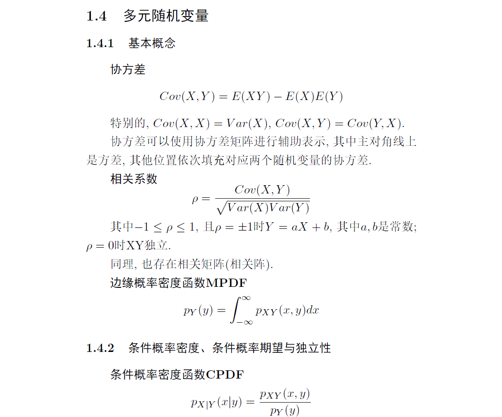
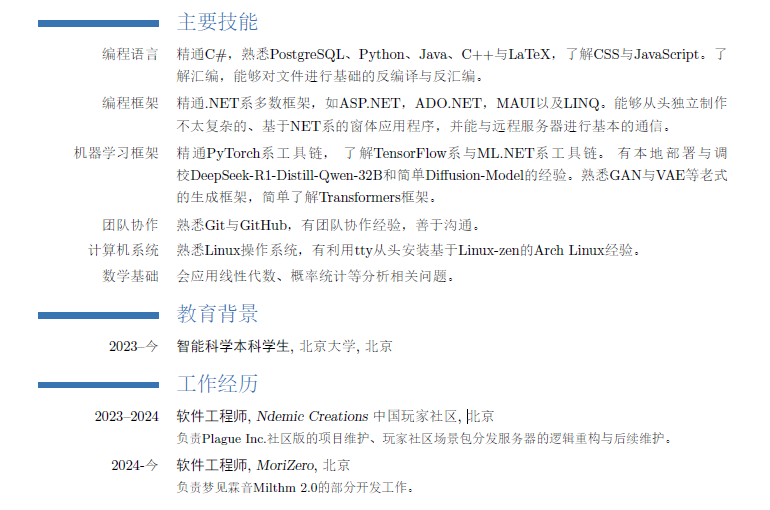
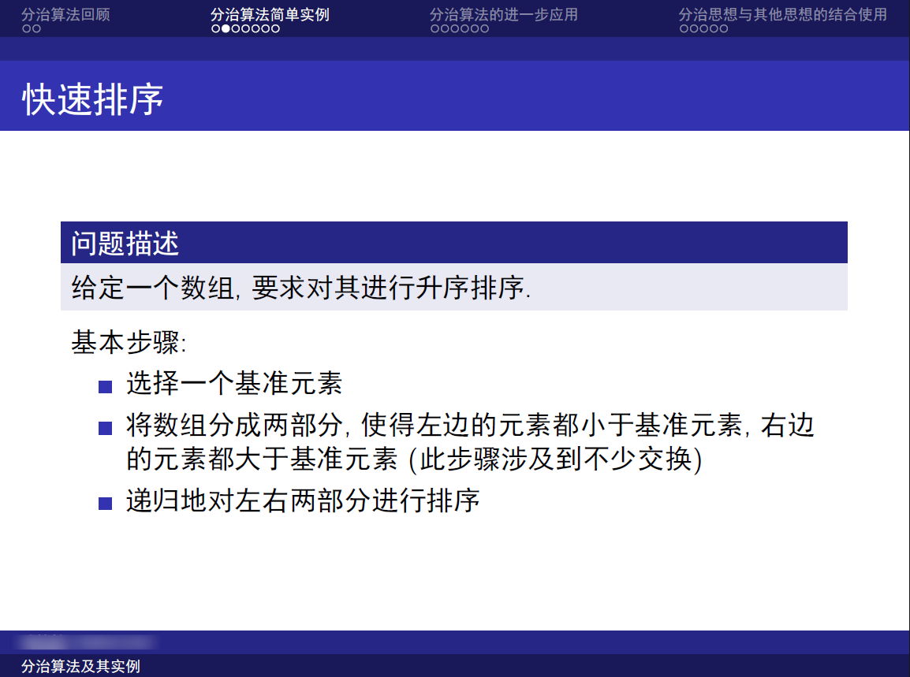

# 文本编辑: Markdown, $\LaTeX$ 和 Typst

::: info 本文信息
作者：TheOnlyEthene, Tianqi Zhang

状态：尚未审阅
:::

## 引言

文本编辑工具是我们表达思想、传递知识的重要手段。无论是在科研、写作还是展示中，排版都是重要且必要的内容；我们需要选择合适的排版工具，以大大提高作品质量。

有一部分同学可能会认为，我们已经有微软提供的排版利器 Microsoft Word 了，为什么还需要这些看起来非常复杂的内容呢？这是因为，Word 虽然操作简单而舒适了，但是它既不能够像 $\LaTeX$ 一样很好地兼容公式、插图、算法等内容，也不能像 Markdown 一样足够轻量级、且完美兼容网络通行的 HTML 格式。而在科研中，$\LaTeX$ 更是大多数刊物指定的唯一排版工具，因此不学习相关的内容甚至在科研界寸步难行。

让我们先从最简单的 Markdown 开始吧：

## Markdown

### 什么是Markdown？

Markdown 是一种轻量级的标记语言，可用于在纯文本文档中添加格式化元素。和其他排版工具相比，它仅仅使用十几个记号进行排版。这使得它易于学习，使得使用者能够更专注于内容的同时，快速地进行美观大方的排版。如你所见，我们所有 Getting Started 文章都是由 Markdown 书写的。

### 怎样使用Markdown？

Markdown 甚至没有自己的专用编辑器，由此可见其轻量级，令人感叹。一般的，VS Code 已经集成了 MD 的编译，因此你完全可以于 VS Code 中创建一个名为 `*.md` 的文件，然后进行相关的操作。如果需要预览，则可以使用 VS Code 自带的侧边预览功能！

Markdown 的内容输入和纯文本文件几乎一模一样, 接下来我们将逐个介绍 Markdown 排版所用到的控制符号。值得注意的是，常用的标点符号（逗号、句号、问号等）均不是控制符号。

不过，在此之前，请把你的输入法标点符号切换为半角，防止出现类似于臭名昭著的￥￥错误；而我在接下来的内容中也会切换为半角！

#### 分段, 换行, 分割线

在 Markdown 中, 必须通过空行来进行分段. 也就是说, 如果你想要对文件进行分段, 需要在两段之间加入一个空行. 特别注意, Markdown 不接受缩进或者首行缩进, 所以不要使用 `Tab` 键或者空格进行缩进! (否则会编译为代码块)

而如果希望仅仅换行而不分段, 则仅仅在行尾加入两个空格, 然后另起一行, 在新的行中书写; 或者使用兼容性更加好的 HTML 标记, 也就是 `<br>` 符号, 该符号无需另起一行也可以进行换行操作. <br>
同时, 你可能会在某些网站看到行尾 \\ 或者直接换行来进行换行操作, 这是因为 Markdown 语法具有明显的**方言性**特征, 不同的 Md 编译器对不同符号的处理不尽相同. 为了兼容性起见, 不建议使用这些符号. 

对于分割线 (你经常会在知乎看见这种分割线), 请在单独一行上使用三个或多个星号 (`***`)、破折号 (`---`) 或下划线 (`___`) ，并且不能包含其他内容。为了兼容性考虑, 请在该分割线前后加上空行.


#### 转义符号 `\`

符号 `\` 是转义符. 该符号接下来的下一个符号**不会**被编译为 Markdown 的控制符号(代码块外, 代码块内的转义参见代码符号). 这使得你能够在不影响排版的前提下, 随意打出几乎所有的符号! 

#### 标题符号 `#`

符号 `#` 是标题符号. 在一行的开头打 `#` 号, 再接一个空格, 后面的内容就会被编译成标题. 这个空格不是必须的, 但是为了兼容性考虑, 建议加上. 

打几个 `#` 号, 最终编译出来的就是几级标题.

#### 强调符号 `*` 和 `~`

这两个符号用于特别强调的词句, 可以实现**粗体**, *斜体*, ***粗斜体*** 和 ~~删除线~~.<br>
上述四个格式分别可以使用下列方法表示: `**粗体**`,`*斜体*`, `***粗斜体***`, `~~删除线~~`.

你可能会在有些地方见到使用下划线 `_` 来进行类似操作的, 但是同样为了兼容性考虑我不建议这样做. 

值得注意的是, Markdown不原生支持 <u>下划线</u> ; 但是因为 Markdown 是 HTML 的子集, 所以完全可以使用HTML中的下划线控制符号 `<u>下划线</u>` .

#### 代码符号 `` ` ``

这个符号用于进行代码高亮与代码块高亮. 

小块代码高亮使用方法非常简单: 使用 `` ` `` 把你需要的代码内容包装起来即可, 例如 `` `Hello, world!` ``

代码块则稍稍复杂一些, 你可以使用 `` ``` `` 把你需要的代码块内容包装起来. 在第一个 `` ``` `` 之后, 你可以手动指定代码使用的语言. 直接进行缩进也可以定义代码块. 

代码块**不属于** Markdown 正文, 因此内部的内容**不会**被编译. 你可以用完全相同的方式输入任何代码, 而不必增加多余的空行. 下面就是一个实例: 

```cpp
#include <iostream>
#include <cstdio>

int main()
{
    std::cout << "Hello, world!" << std::endl;
    return 0;
}
```

如果需要在代码块中打出 `` ` `` 且防止此反引号被编译, 你可以这样编译: ``` `` ` `` ``` . 只要保证用于包装的反引号数量比防止编译的反引号数量多就可以了. 注意, 一定要使用空格分开反引号以避免歧义! 

#### 列表符号 `1.` 和 `-`

要创建有序列表和无序列表, 可以分别使用上述的两个符号. 上述几个符号和标题符号的使用方法类似, 这两格符号位于行首, 前面不能有内容, 后面应该有空格. 

有序列表无序列表之间是可以嵌套的; 如果要制作多级列表, 请使用 `Tab` 缩进多级列表的内容即可.

值得注意的是, 有序列表中的 `1.` 也可以替换为其他数字, 反正满足数字加个点就行, Markdown 会自动帮你排序. 

例如: 

```
1. 甲乙丙丁
1. 戊己庚辛
    1. 子丑寅卯
    1. 辰巳午未
        - 申酉
        - 戌亥
1. 壬癸
```

会编译为:

1. 甲乙丙丁
1. 戊己庚辛
    1. 子丑寅卯
    1. 辰巳午未
        - 申酉
        - 戌亥
1. 壬癸

#### 引用符号 `>`

这个符号用于插入引用块, 处于引用块内部的文字与普通文字一样. 和标题符号一样, `>` 后面最好是有一个空格, 且前面什么都不要有. 

引用块也是可以堆叠的, 只需要多增加几个引用符号即可: 

> 偏差认知了
>> 偏差认知
>>> 偏差认
>>>> 偏差
>>>>> 偏

~~故障机器人是杀戮尖塔最强角色!~~

如果需要在不切断引用块的情况下分段, 请在预定的空行开头也加上上述引用符号. 

#### 表格

你可以使用下列手段创建一个原生表格: 使用三个或多个连字符（`---`）创建每列的标题，并使用管道（`|`）分隔每列。您可以选择在表的任一端添加管道。

你不必过度在意排版问题, 编译器会自动给你编译出优美的格式.

如果要使用左对齐/居中/右对齐, 请在连字符那里添加冒号: 左对齐使用 `:---`, 居中使用 `:---:`, 右对齐使用 `---:` .

下面是一个实例:

```
| Syntax | Description |
| --- | ----------- |
| Header | Title |
| Paragraph | Text |
```

得到的表格是这样的:

| Syntax | Description |
| --- | ----------- |
| Header | Title |
| Paragraph | Text |

表格中可以添加链接, 代码（仅反引号（`）中的单词或短语, 而不是代码块）和强调; 但是不能添加标题, 块引用, 列表, 图像或HTML标签。

#### 外部路径: 图片与链接

要添加图像，请使用感叹号 (!), 然后在方括号增加替代文本，图片链接放在圆括号里，括号里的链接后可以增加一个可选的图片标题文本。

例如, 这是本文作者的 GitHub 头像, 则使用 ``


如果你需要在文档中插入链接, 则把链接文本放在中括号内, 链接地址放在后面的括号中.

例如, 一个著名代码共享平台叫做 [Github](https://github.com), 其中 Github 这个超链接就是使用代码`[Github](https://github.com)`完成的.

对于图片型超链接, 则把前面的中括号内的链接文本改为上述的图片路径即可. 

#### 公式符号: `$` 
使用 `$ $` 框住对应的 $\LaTeX$ 公式, 即可将对应的公式按照 $\LaTeX$ 格式编译出来, 使用方法和 $\LaTeX$ 完全一致. 如果需要进一步教学, 请移步 $\LaTeX$ 相关篇章. 

特别注意: 公式的前后应该有空格, 否则不会编译. 这是 Markdown 的自动转义特性导致的. 

```plaintext
这样写:
这是一个 $\Latex$ 公式

而不要这样写:
这是一个$\Latex$公式
```

例如: 调和级数 $\sum_{i=1}^n \frac{1}{i}$ 可以使用 `$\sum_{i=1}^n \frac{1}{i}$` 进行编译. 

特别提醒: 一定要用半角标点符号, 否则你会见到臭名昭著的 ￥￥ 类错误.

## $\LaTeX$

### 什么是 $\LaTeX$ ?

$\LaTeX$ 是一种极为专业的**排版**工具, 而**不是**文本编辑器. 它的源文档与 Markdown 的简洁干净不同, 而是充斥了各种各样的反斜杠, 大括号和宏. 这表明了如果直接使用 $\LaTeX$ 进行文本编辑的话会令人极度头大乃至效率降低; 因此我个人建议同学们在使用上述工具时, 最好是心中打好腹稿然后再进行工作. 

纵然如此, $\LaTeX$依然是目前最强大的排版工具, 没有之一. 其强大的功能甚至能够支持其于一个PDF文件中写一个 Linux 系统; 而且这个系统甚至可以直接运行! 虽然如此, 我们暂时不需要研究 Linux in PDF 的工作原理, 还是从最简单的 $\LaTeX$ 安装与使用开始吧.

### 怎样安装 $\LaTeX$ ?

Waiting for Tianqi Zhang's works ... 

### 怎样使用 $\LaTeX$ ?

$\LaTeX$ 功能最强大的一点在于它支持巨量的包与文件类型, 使得它能够适用于大量工作: 短文用 `article`, 长文用 `report`, 书本用 `book`, 信件用 `letter`, 简历用 `moderncv`, 幻灯片用 `beamer`... 遗憾的是, 上述文档类型除了大部分相同的通用语法以外, 还都有着自己独立的宏和语句功能. 如果需要全部精通上述文档类型, 难度不亚于掌握 `C++23` 的所有发行包, 连笔者都不能说自己全部掌握了它们. 因此我将仅仅讲述基本语法, 实用包和几种文档类型. 







### 基本语法

一个最基本的 $\LaTeX$ 文档应该如下代码块所示:

```latex
\documentclass{article}

\begin{document}
Hello, Latex!
\end{document}
```

上述第一行代码表明了文章的类型是 `article`, 其意思是短文, 通常用于不太长的论文书写, 是 $\LaTeX$ 的最基本文档类型. 

中间的 `begin...end` 结构则是 $\LaTeX$ 中最常见也最通用的宏类型, 它标志一个内容类型的起止. 几乎所有的内容类型都需要它. 在本文中, 其意思为正文的开始与结束. 

在 `begin...end` 结构之内的则是文章内容, 其分段手段与 Markdown 类似, 使用空行分段; 但是换行则需要使用符号 `\\`(双反斜杠) 而不是行尾空格或者 HTML 控制符. 

对于转义符号, 与 Markdown 的使用完全相同, 这里不再赘述. 

#### 标题

$\LaTeX$ 标题由 `\maketitle` 提供, 它应该紧随 `\begin{document}` 之后. 该标题的内容则需要在其他地方标明, 且标明的地方应该在 `\maketitle` 之前. 

下面是一个实例: 

```latex
\title{我是标题内容}
\author{我是作者}
\date{我是日期}
% \date{\today} 可以直接使用当日日期

\begin{document}
\maketitle % 这个的意思就是我把标题放在这里
我是正文
\end{document}
```

#### 下级标题
$\LaTeX$ 最多支持四级标题. 其宏为`\section`, `\subsection`, `\subsubsection`.

$\LaTeX$ 会给标题自动打上编号. 默认情况下, 编号分别是 `1, 2, ...` , `1.1, 1.2, ...` 和 `1.1.1, 1.1.2, ...`. 如果在标题上面加一个星号 `*` 则不会显示标题.

标题宏后面的大括号内的内容可以缺省, 这样就只有编号没有标题文字. ~~当然如果你想也可以给无编号标题缺省内容, 那样就相当于是空行了~~ ~~但是你为什么要这么做?~~

```latex
\begin{document}
\section{我是二级标题}
\subsection{我是三级标题}
\section*{我是二级标题(无编号)}
\end{document}
```

#### 列表

$\LaTeX$ 有序列表由 `enumerate` 支持, 无序列表由 `itemize` 支持, 两者使用几乎相同, 因此以有序列表为例. 

```latex
\begin{enumerate}
    \item 这是第一项
    \item 这是第二项
\end{enumerate}
```

该列表可以直接插在 `document` 的任意地方. 列表支持多级列表, 只需要嵌套即可.

#### 强调: 粗体, 斜体和下划线

在 $\LaTeX$ 中, 粗体使用 `\textbf{}` 支持, 斜体使用 `\textit{}` 支持, 下划线使用 `\underline{}` 支持. 除此以外, 还可以使用 `\emph{}` 来对文字进行笼统的强调任务, 但是这个强调会随着使用包的不同和上下文环境的不同而改变. 

```latex
这是一个\textbf{粗体}实例
这是一个\textit{斜体}实例
这是一个\underline{下划线}实例
```

#### 公式

~~我说我用 $\LaTeX$ 写作业的唯一原因是它的公式系统你二龙吗~~

行内公式和 Markdown 的使用方式是一样的, 使用 `$...$` 把需要编译的公式包住即可. 例如写一个非常简单的乘法算式 `$3\times 4 = 12$`, 编译出来就是 $3\times 4 = 12$ .

单列公式则会单独列出一行展示, 写法分为两种, 一种是简易形态的, 一种是较为正式的. 简易形态的单列公式使用的是 `$$...$$` , 正式形态的单列公式则使用下面的宏:

```latex
\begin{equation}
3 \times 4 = 12
\end{equation}
```

正式形态的公式有以下的好处:
- 自带公式号;
- 能够更简单地使用 `\label` 等超链接形式.

除了展示方式不一样以外, 行内公式和单列公式的外观也有差别. 一般单列公式的外观更加美观大方, 而行内公式更加紧凑. 比如说求和符号:

$\sum_{i=0}^{10}$

$$\sum_{i=0}^{10}$$

你可以轻易地发现两者的差别. 一般当公式比较长的时候, 应该使用正式形态的公式. 

除此之外, 还有多行公式, 使用的宏是 `align`. 这个公式功能更强大, 不过使用更加复杂. 例如我们要做一个脱式计算, 这时候要考虑对齐问题, 此时则使用 `&` 来对齐 (本质上是制表符) , `\\` 来换行.

```latex
\begin{align}
& 3 \times 4 + 6 \\
=& 12 + 6
=& 18
\end{align}
```

注意到, 有一些符号在键盘是不能直接打出来的, 例如乘号 $\times$ 除号 $\div$ 等; 还有一些非英语字母, 例如阿尔法 $\alpha$. 这些特别的符号在 $\LaTeX$ 都有特殊的宏对应. 你可以查相关的表来打出符号, 或者使用 VS Code 的相关插件. 

### $\LaTeX$ 实用包简介

先前提到, $\LaTeX$ 功能最强大的一点在于它支持巨量的包. 下面我将会举例几个最简单有用的包. 不过我们应该先学会使用包:

```latex
\documentclass{article}
\usepackage[UTF8]{ctex}

\begin{document}
你好, \Latex!
\end{document}
```

如上代码块所示, 你直接在文件类型下面增加一个使用包的命令即可, 很类似于 `C++` 的 `#include` 预编译指令, 或者 `Python` 的 `import` 指令. 中括号内的内容是调用包时进行的设置, 不同的包有不同的设置, 具体请参见相关网站.

#### `ctex`

伟大无需多言的中文支持, 使用方法刚刚已经举例过了. 

#### `AMS` 系列

美国数学会出品的一系列宏包. 学会根据其印刷和电子出版物以及在线资料库的样式要求, 编写了一组用于排版数学出版物的宏包套件. 我们在这个系列中最经常使用的包有下列三个:

- `amssymb` 提供符号;
- `amsfonts` 提供字体; 
- `amsmath` 提供算符.

直接使用 `usepackage` 命令引用即可. 

#### `geometry` 

这是一个完全负责版式的宏包, 比 $\LaTeX$ 自带的版式配置要好用得多. 

```latex
\usepackage{geometry}
\geometry{a4paper, margin=1in} % A4纸张, 页边距1英寸
```

#### `graphicx`

这是一个专门负责图片的宏包. 具体使用较为复杂, 参见 [Overleaf官方网站: 插入图片](https://www.overleaf.com/learn/latex/Inserting_Images). 

在使用这个宏包的时候, 建议把图片全部放到同一个位置, 以便于整理.

#### `listings`

这是一个专门负责代码的宏包. 具体使用较为复杂, 参见 [Overleaf官方网站: 列出代码](https://www.overleaf.com/learn/latex/Code_listing). 

上述官方网站列出了一个叫 `verbatim` 的宏包, 但是它过于~~香草味~~原始, 我个人非常不喜欢这个宏包, 不建议使用它来展示代码. 不过 `verbatim` 非常适合在 $\LaTeX$ 中教学 $\LaTeX$, 这是因为这个结构内的所有内容都会被**直接打印**.

#### `algorithm2e`

这是一个专门负责伪代码的宏包, 在算法伪码上的表现比 `listings` 要好得多. 使用也较为复杂, 参见 [Overleaf官方网站: 算法](https://www.overleaf.com/learn/latex/Algorithms)

#### `cases`

这是一个负责分段函数等的宏包, 在分段函数和方程组上的表现比 `align` 要好得多. 不过有时候 `usepackage` 不需要单独列出这个宏包, 但是有时候不列出来就会出错. 下面的例子是直接从 Overleaf 上节选的, 这里就没有列出. 

```latex
\documentclass{article}
\usepackage{amsmath}

\begin{document}
\maketitle

$$
1+(-1)^n=
\begin{cases}
	0, & \text{if $n$ odd}\\
    2, & \text{otherwise}
\end{cases}
$$

\end{document}
```

这个包还有一些其他的写法, 例如 `subnumcases`, 尚待读者主动探索. 

